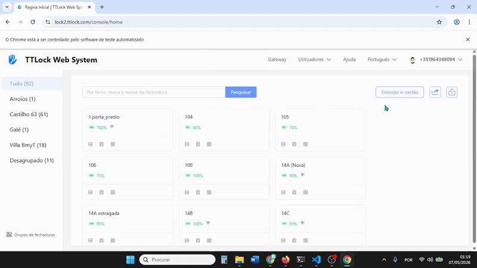
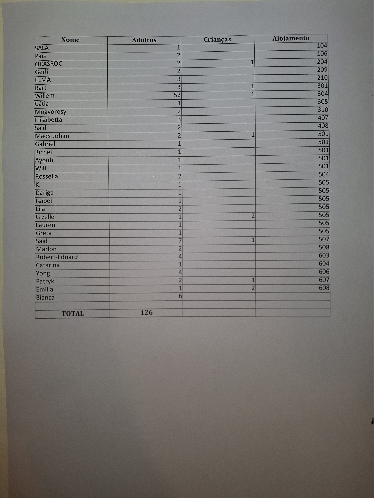
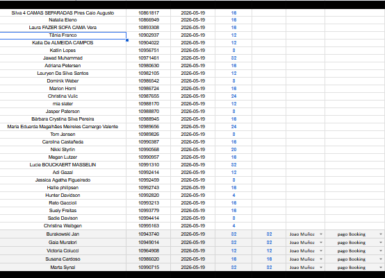
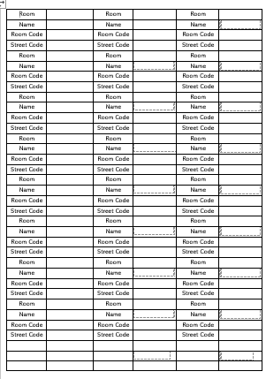
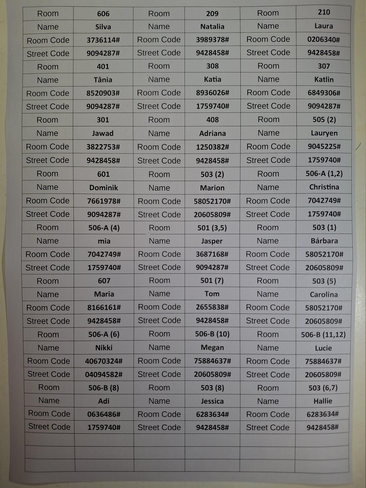
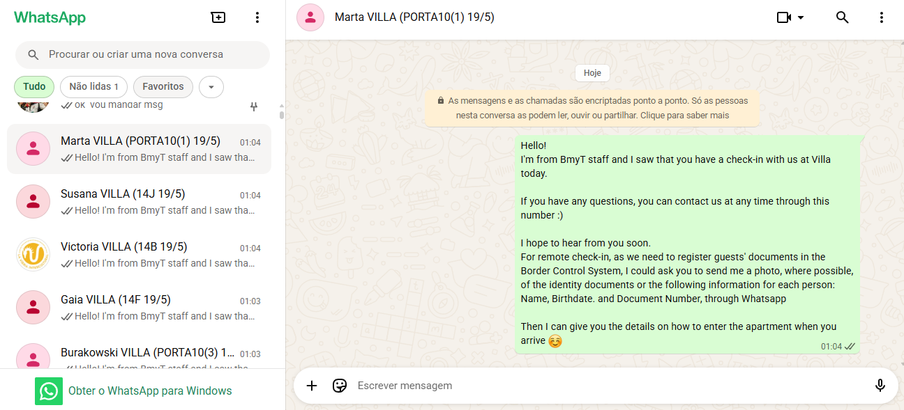

# HC63 Hostel Operations Automation Pipeline

<div align="center">


</div>

I have built a Python automation pipeline to streamline daily hostel operations at **Castilho Hostel & Suites 63**.

This project was developed to solve real operational problems in a live hospitality environment, automating repetitive workflows related to reservations, breakfast lists, city tax processing, door code generation, Word document creation, VCF contact generation, and WhatsApp guest communication.

This pipeline automates the full process from raw reservation exports to printed operational documents and guest communication.

The system is currently used internally and was designed with a practical goal: reduce manual workload, avoid human errors, and make daily operations way faster and more reliable.

Below is the access-code automation in action — one of the highest-impact parts of the pipeline.




---

## 🚀 Impact

The automation reduced a workflow that previously took approximately:

- **1h30 of concentrated work for me**
- **Up to 3h for a less computer-experienced person**

to approximately:

- **8 minutes of automated execution**

While improving reliability and reducing manual errors.

---

## 🧠 Why This Project Matters

This was not a school project or tutorial.

It was built because there was a real operational need inside a working business. The project required understanding deeply the hostel workflow, identifying bottlenecks, designing a reliable automation process, and improving it incrementally as real-world issues appeared.

The main focus was not overengineering, but building something that works consistently in daily usage.

---

## 🏗 General Architecture

The pipeline is controlled by a central orchestrator:

```text
manager.py
```

`manager.py` is responsible for coordinating the full workflow, including:

- Creating the daily log file if it does not exist
- Checking required environment credentials
- Logging into Ynnov, the reservation platform
- Exporting, converting and duplicating Excel files for each automation stage
- Creating and printing the breakfast list
- Creating and setting the city tax list
- Logging into TTLock, the access-code platform
- Parsing reservation data and generating all required access codes
- Inserting generated codes into a Word template and printing the final document
- Creating and sending the VCF contact file
- Parsing guest contacts and sending WhatsApp messages
- Cleaning temporary files safely

The project follows a simple principle:

> The Excel files are the source of truth.

---

## 🔐 Credentials and Safety

Credentials are stored in the computer environment variables instead of being hardcoded in the source code.

Before starting the automation, the system verifies that the required credentials exist. This avoids running an incomplete process and helps prevent crashes caused by missing configuration.

---

## 🔄 Full Automation Flow

### 1. PMS Login and Reservation Export

The automation logs into **Ynnov**, the PMS used to manage reservations.

From there, it exports two `.xls` files:

1. A file containing all guests currently staying in the hostel
2. A file containing all guests checking in the next day

These files are then converted to `.xlsx` and duplicated depending on the operational task they will support.

---

### 2. Breakfast List Generation

From the reservation export, the automation creates a breakfast list containing:

- Guest names
- Number of adults
- Number of children
- Room information
- Total number of people

The script also parses and cleans invalid entries, removing guests who should not appear in the breakfast list for several operational reasons.

After the list is generated, it is printed automatically.

<p align="center">
    
</p>

---

### 3. City Tax List Generation

The tax list is generated from reservation data and contains:

- Guest names
- Dates
- Tax values to be paid
- Booking reservation ID
- Property associated with the reservation

The final result is prepared in a format suitable for operational usage and tracking.



---

## 🔑 Door Code Automation

The heart of the pipeline is the access code automation.

Starting from a copied `.xlsx` file, the system parses the reservation data to extract and normalize:

- Guest first name
- Number of nights
- Room name in a presentable format
- Reservation grouping information

The automation then groups guests by number of nights and creates a shared **street door code** for each group.

After that, it processes each reservation individually and creates a specific **room code** for each guest, with:

- The correct number of nights
- The correct room
- The correct guest assignment

This is one of the most important parts of the system because creating a single guest code manually requires around **50 clicks and/or key presses**.

Each code creation is wrapped in error handling so that if one code fails, the automation logs the problem and continues instead of crashing the entire pipeline.

---

## 📄 Code List Generation

After the access codes are created, the automation generates a final `code.xlsx` file with the following structure:

| Column | Data |
|---|---|
| A | Guest Name |
| B | Room |
| C | Number of Nights |
| D | Room Code |
| E | Street Code |

This information is then inserted into a pre-existing Word document template.

The automation fills the table in the correct format and ensures that the final document is ready to be printed and used by the team.

If the table is completed successfully, the code list is printed automatically.


<p align="center">
    
</p>

<p align="center">
    
</p>


---

## 📱 WhatsApp and VCF Contact Automation

The pipeline also automates part of the remote check-in process for a separate property.

From another copy of the reservation file, the automation extracts the guests associated with the remote property and formats:

- Names
- Phone numbers
- Room information

It then creates a `.vcf` contact file containing all required guest contacts.

The file is sent to the Hostel's WhatsApp, opened on the phone, and imported directly into the contacts list.

This allows multiple guest contacts to be created almost instantly instead of manually registering each one.

After that, the automation uses WhatsApp Web links to send the first remote check-in message to each guest.

To reduce the risk of being blocked or flagged by WhatsApp, messages are sent with a randomized delay between **8 and 10 seconds**.


<!-- WhatsApp messages sent -->


---

## 🧹 Cleanup and Debugging Strategy

At the end of the execution, the automation deletes temporary files that are no longer needed.

However, it intentionally keeps some generated files when useful, especially the code list.

If an error occurs in a specific section, the corresponding file is not deleted. This allows the valid part of the generated data to still be used manually and also helps with debugging.

The goal is:

> Avoid total failure whenever partial recovery is possible.

This approach was important because the project is used in a real operational environment where the work still needs to be completed even if one part of the automation fails.

---

## 🛠 Technologies Used

- Python
- Selenium
- openpyxl
- WhatsApp Web automation
- VCF contact generation
- Excel file processing
- Word document automation
- Environment variables
- Logging
- Browser automation
- File cleanup utilities

---

### Excel Parsing and Data Cleaning

Reservation exports contain data that needs to be cleaned, filtered, converted, and reorganized.

The automation handles:

- `.xls` to `.xlsx` conversion
- Duplicated files for different workflows
- Row deletion based on keywords
- Stale row issues after deletion
- Guest filtering
- Reservation grouping
- Formatted operational outputs

---

### Error Handling and Recovery

The automation is designed to continue whenever possible.

Instead of crashing immediately, it uses logging and localized error handling so that one failed guest code or one failed section does not necessarily destroy the whole workflow.

This was especially important for access code generation, where each guest is processed individually.

---

### Real-World Workflow Design

A major challenge was not only writing code, but understanding the actual hostel workflow well enough to automate it correctly.

The system had to match the way the team works, including:

- Printed documents
- Existing templates
- WhatsApp habits
- PMS exports
- Access code systems
- Remote check-in workflow
- Manual fallback needs

---

## 📚 What I Learned

This project strengthened my understanding of:

- Automation design
- Python scripting
- Browser automation with Selenium
- Excel processing with openpyxl
- File generation and cleanup
- Operational reliability
- Debugging real-world systems
- Error handling and recovery
- Workflow analysis
- Incremental software improvement

Most importantly, it showed me how software can directly solve operational problems and create measurable value in a real environment.

---

## 🔒 Repository Note

This repository does not contain the full private production source code.

The project is currently used internally in a real business environment, and the full implementation includes operational details, credentials, workflows, and integrations that are not appropriate to publish publicly.

This repository exists as a technical overview and portfolio presentation of the project architecture, workflow, and impact.

---

## 👤 Author

- João Muñoz
